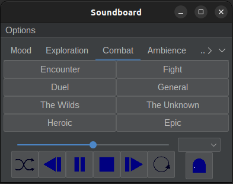

# Soundboard GUI

Contains a GUI for using the `discord-console-bot` to play songs pulled from a simple playlist storing system.

## Structure

- The docs directory contains images used in this Readme.
- The server module contains a standalone dummy server for debugging and testing against.
- The soundboard module contains the gui application for the `discord-console-bot`.
- There is a Makefile for building, running and testing the application.

## GUI

- Splash screen once the application has loaded. Click to connect to the websocket of the `discord-console-bot`.
  

- Select from a number of playlists. Choose the channel to play in, toggle shuffle, looping, repeating, etc.
  

- Manage your catalogue of playlists by sorting them into different categories.
  

